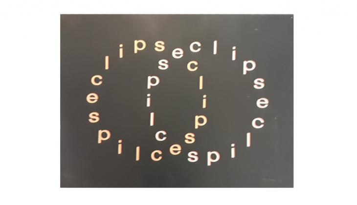
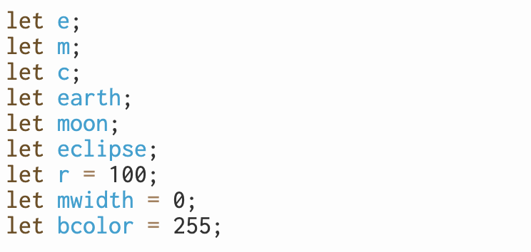
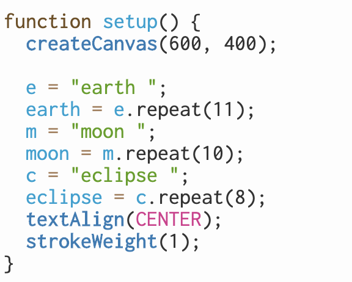
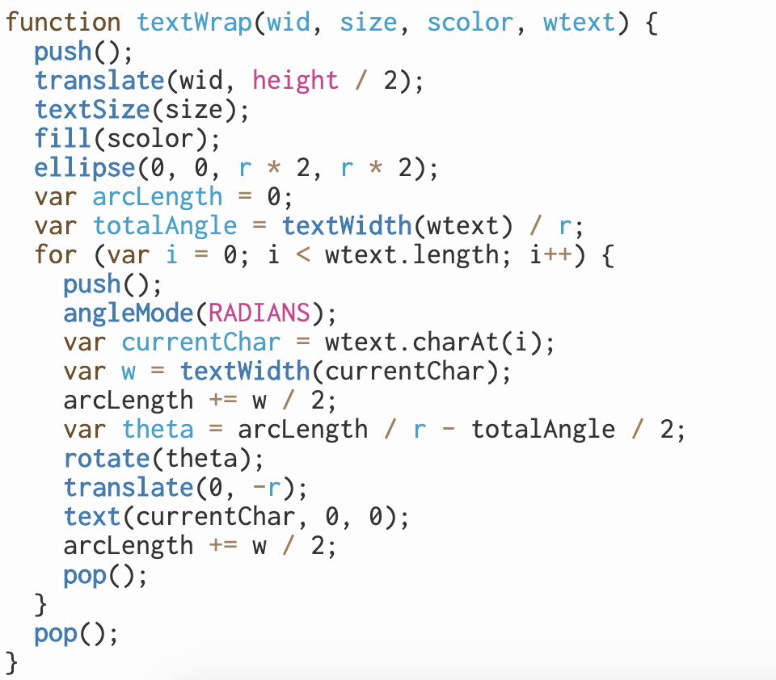
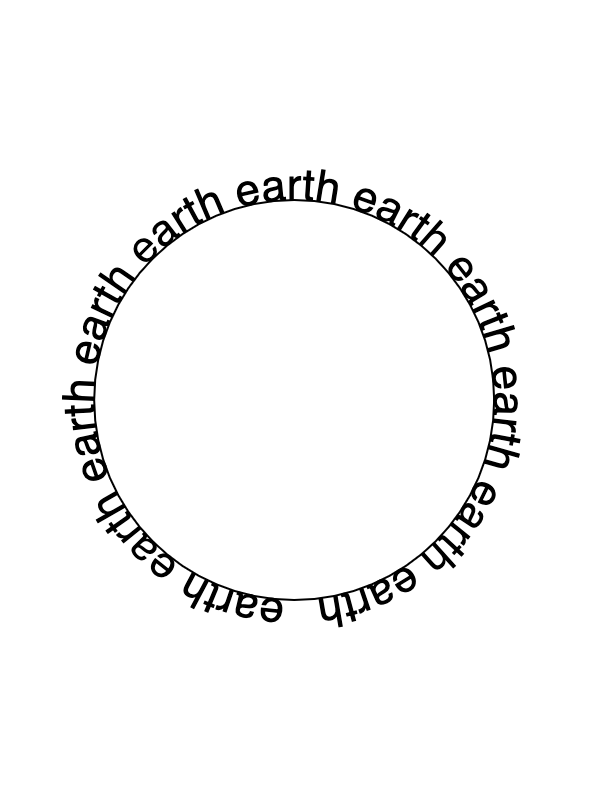
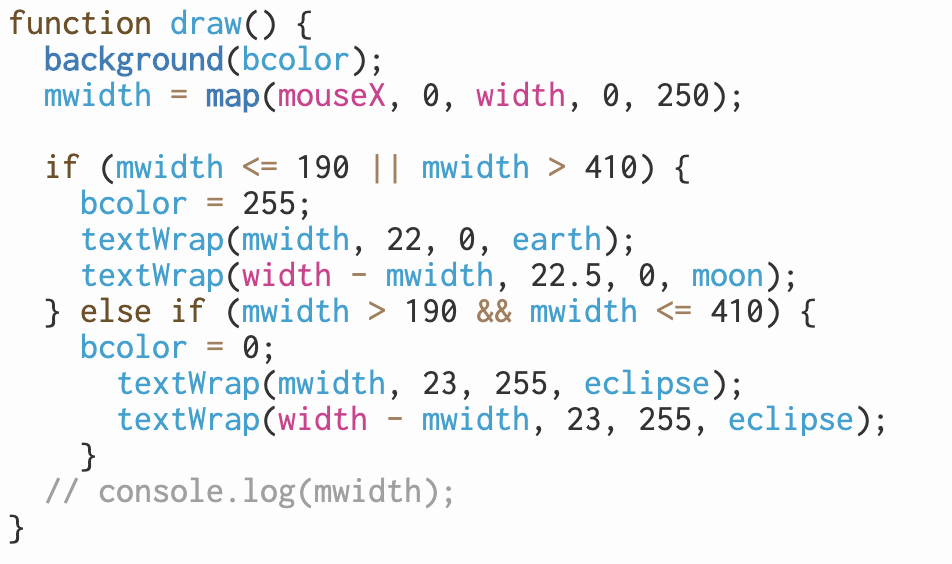
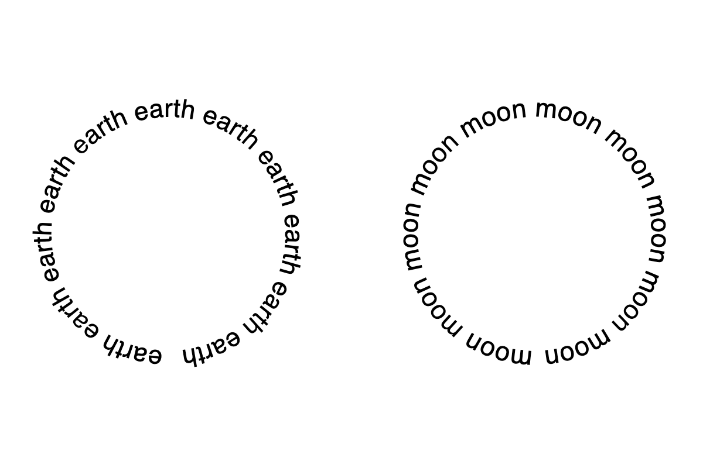
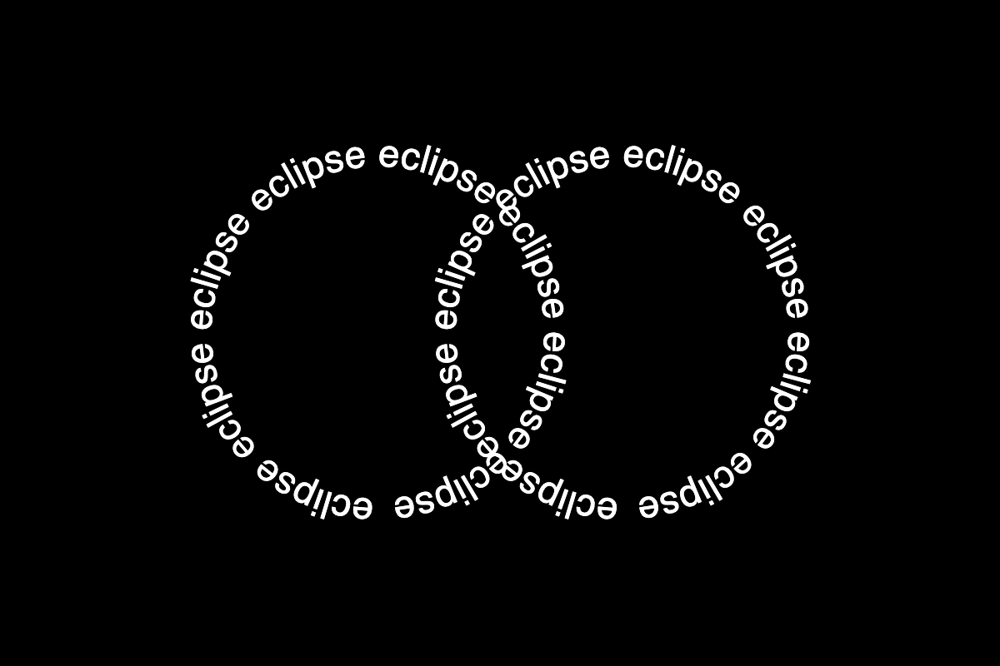

<h1>Week04 Assignment</h1>
I took two different approaches to create three concrete poems, one using p5.js and others using python. 

<h2>Eclipse</h2>
Link to p5.js sketch: https://editor.p5js.org/kh1785/sketches/4nBmBFaK
  
While I was searching for inspiration, I encountered this concrete poem.

I thought it would be nice to create an interactive version of it, which simulates a real eclipse.

 
Declaring variables.

Setup function

I first made text to wrap a circle to represent the shape of moon and earth.
Testing a textWrap function.

 
Test result 

When those two circles collide, both moon and earth will turn into eclipse analogous to the real-world phenomenon. I used a map function to map position of mouseX.

 
Screenshot images

 
<h2>My Fair Poem 1 & 2</h2>
Link to Jupyter notebook: 
https://github.com/TTurbo0824/material-of-language/blob/master/Week04/Week04_Assignment.ipynb
  
Link to html files: 
https://github.com/TTurbo0824/material-of-language/blob/master/Week04/my_1.html
https://github.com/TTurbo0824/material-of-language/blob/master/Week04/my_2.html
 
 
Link to YouTube video: 

 

